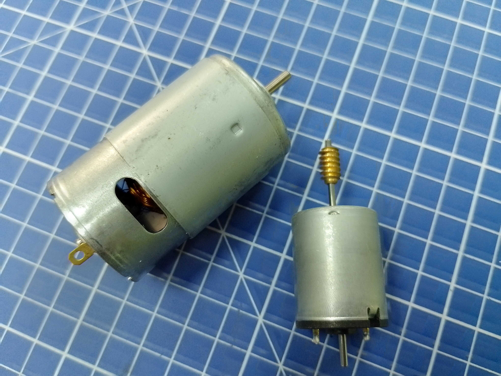
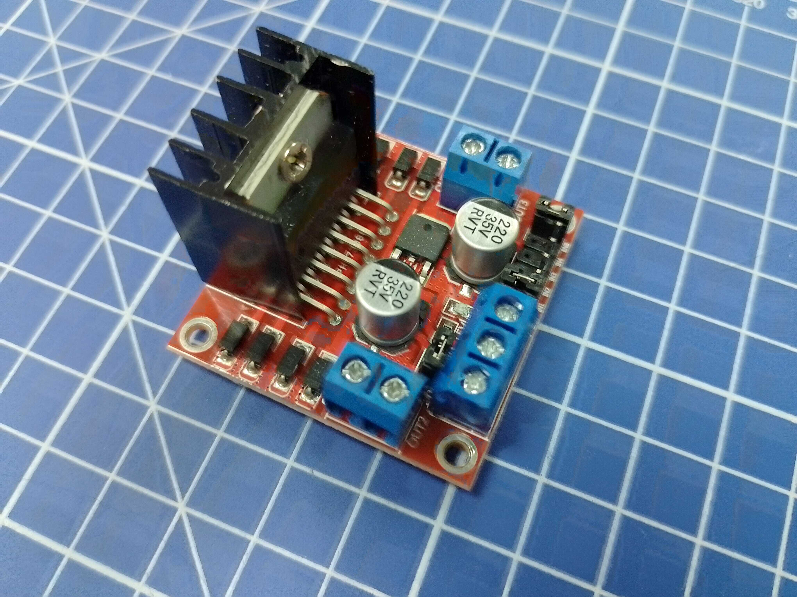
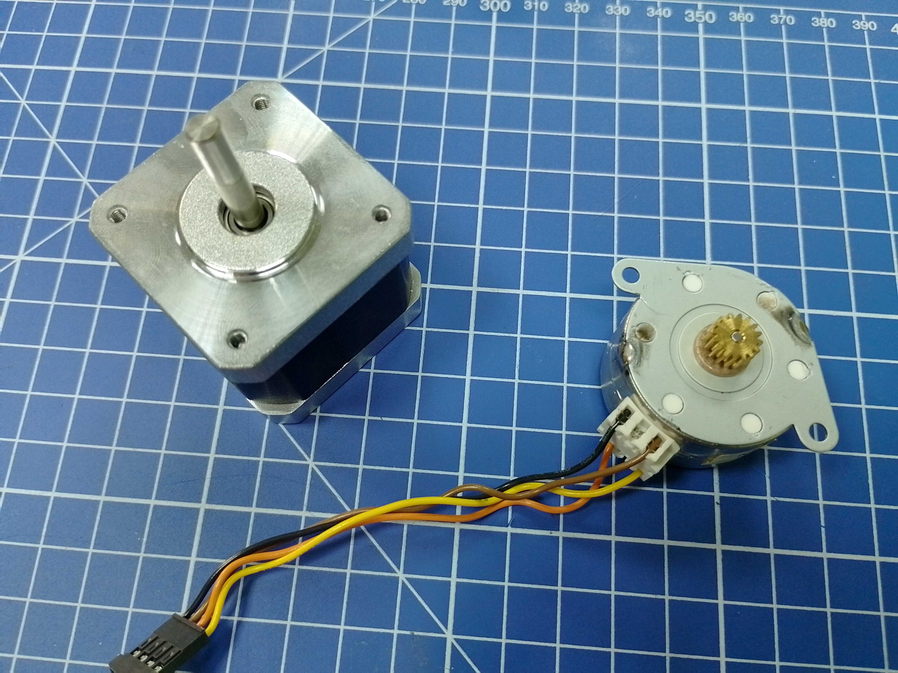
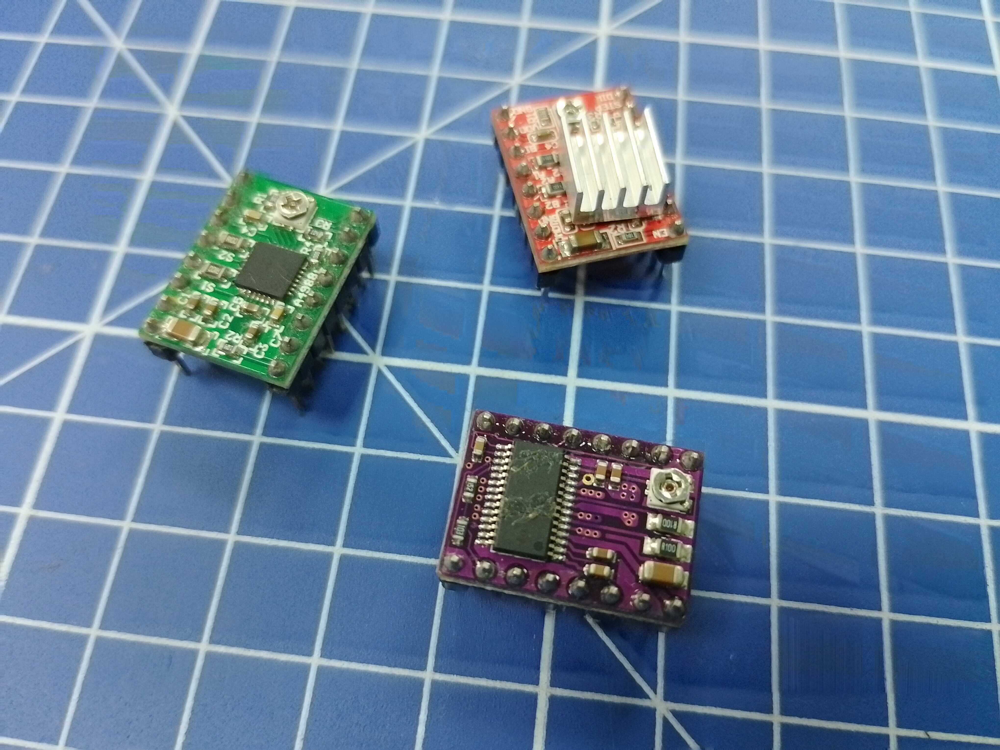
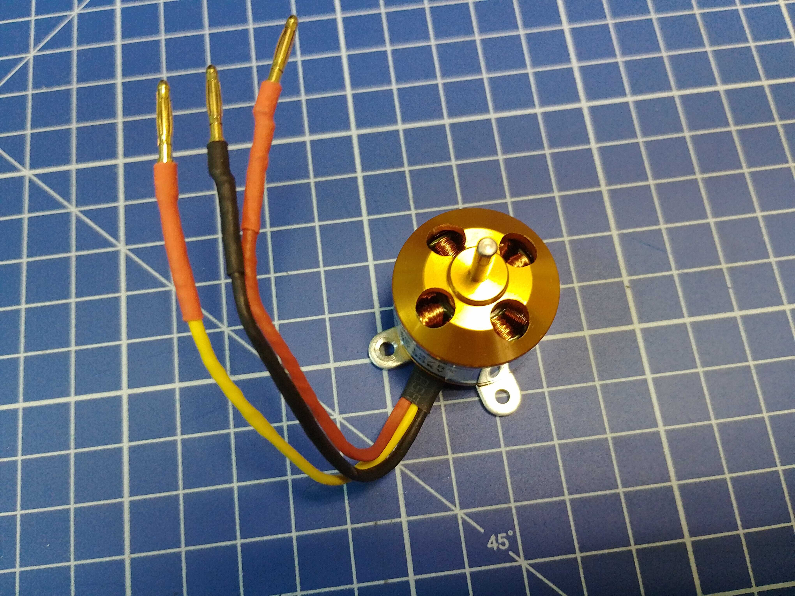
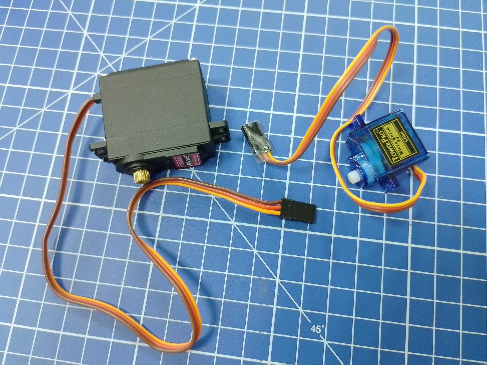

# Intro

В первой части представлены проекты, для знакомства с основными типами электродвигателей. Каждый раздел отвечает на следующие вопросы:
1. Как устроен двигатель данного типа?
2. Как двигатель подключается к микроконтроллеру?
3. Как написать простейшую программу для управления?

А ещё есть вот такая книга:  
Motors for Makers: A Guide to Steppers, Servos, and Other Electrical Machines

# Моторы (часть первая)

## DC motor

Коллекторный мотор постоянного тока - один из наиболее распространенных типов двигателей. Общие принципы работы разобраны в видео ниже:

[DC Motor, How it works?](
https://www.youtube.com/watch?v=LAtPHANEfQo)

Чтобы подключить мотор к микроконтроллеру, нужен драйвер. Это специальная микросхема позволяющая с помощью сигнала малой мощности с контроллера управлять  током, управлять током, поступающим в двигатель. Для каждого типа двигателей разработаны собственные типы драйверов. На видео представлены драйверы и схемы подключения для DC-моторов.

[Motor Driver in depth | H-Bridge | L293D, L298N, TB6612FNG, VNH2SP30](
https://www.youtube.com/watch?v=PVyAcgYkzDs)

[Driving DC Motors with Microcontrollers](
https://www.youtube.com/watch?v=ygrsIqWOh3Y)

[Controlling DC Motors with the L298N H Bridge and Arduino](
https://www.youtube.com/watch?v=dyjo_ggEtVU)

[How DC GEAR MOTOR Works with ARDUINO and L298N](
https://www.youtube.com/watch?v=GPVC84D5ULw)

## Stepper motor

Шаговый мотор – бесщеточный двигатель постоянного тока, который способен благодаря своему дизайну выполнять вращения на небольшие углы (шаги). 
Разобраться с его внутренним устройством поможет видео:

[How Stepper Motors Work](
https://www.youtube.com/watch?v=09Mpkjcr0bo)

Для управления шаговым мотором небольшой мощности удобнее всего использовать драйвер A4988 и аналоги, но в качестве эксперимента можно запустить и с помощью схемы L298n для DC-моторов. Следующие две статьи рассказывают о схемах подключения шаговых двигателей с помощью различных драйверов и принципах их программирования.

[How to control a stepper motor with A4988 driver and Arduino](https://www.makerguides.com/a4988-stepper-motor-driver-arduino-tutorial/)

[Control a stepper motor with L298N motor driver and Arduino](
https://www.makerguides.com/l298n-stepper-motor-arduino-tutorial/)

[Stepper Motors and Arduino – The Ultimate Guide](
https://howtomechatronics.com/tutorials/arduino/stepper-motors-and-arduino-the-ultimate-guide/)

[Stepper Motors with Arduino - Controlling Bipolar & Unipolar stepper motors](
https://www.youtube.com/watch?v=0qwrnUeSpYQ)

## BLDC drive

Бесщеточный электрический мотор постоянного тока (он же вентильный двигатель) – наиболее хитро устроенный двигатель в плане управления. Без платы управления запустить его не получится запустить в принципе. На таких двигателях сегодня летает большинство коптеров, но, конечно, мотор можно использовать и для других целей.

[Brushless Motor - How they work BLDC ESC PWM](
https://www.youtube.com/watch?v=yiD5nCfmbV0&pp=ygUKYmxkYyBtb3Rvcg%3D%3D)

[How Brushless Motor and ESC Work and How To Control them using Arduino](
https://www.youtube.com/watch?v=uOQk8SJso6Q)

## Servomotor

На самом деле это не тип двигателя, а конструкция включающая какой-то мотор и систему обратной связи, позволяющую отслеживать и контролировать вращение вала двигателя в соответствии с заданными параметрами.

Несколько примеров работы с сервомоторами, в которых обратная не выходит за пределы управляющей микросхемы:

[How Servo Motors Work & How To Control Servos using Arduino](
https://www.youtube.com/watch?v=LXURLvga8bQ)

[Servo Motors, how do they work?](
https://www.youtube.com/watch?v=1WnGv-DPexc)

[Using Servo Motors with Arduino](
https://www.youtube.com/watch?v=kUHmYKWwuWs)

[How to Control Servo Motors with Arduino – Complete Guide](
https://howtomechatronics.com/how-it-works/how-servo-motors-work-how-to-control-servos-using-arduino/)

Или добавить возможностей моторам, у которых канал обратной связи не выведен на микроконтроллер 

[Analog Feedback Servo Motor](
https://dronebotworkshop.com/analog-feedback-servo-motor/)

Кроме того в Хакспейсе есть и серво-моторы с полноценной линией обратной связи.

